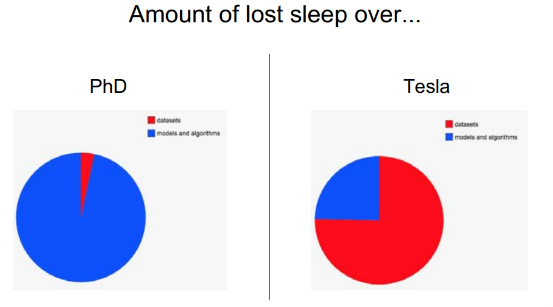

# Data Science

- research = worry about models
- actual applications = worry about data
- this course is about the data

## Course notes

[visualization.ipynb](https://github.com/ADGEfficiency/teaching-monolith/blob/master/data-science/visualization.ipynb)
- matplotlib APIs
- t-SNE & PCA

[data-cleaning.ipynb](https://github.com/ADGEfficiency/teaching-monolith/blob/master/data-science/data-cleaning.ipynb)
- cleaning columns in place
- work that has to be done

[feature-engineering.ipynb](https://github.com/ADGEfficiency/teaching-monolith/blob/master/data-science/feature-engineering.ipynb)
- adding new columns
- optional work that improves performance

[linear-models.ipynb](https://github.com/ADGEfficiency/teaching-monolith/blob/master/data-science/linear-models.ipynb)

[imbalanced-classes.ipynb]

[model-selection.ipynb](https://github.com/ADGEfficiency/teaching-monolith/blob/master/data-science/model-selection.ipynb)
- what models to try

[model-evaluation.ipynb](https://github.com/ADGEfficiency/teaching-monolith/blob/master/data-science/model-evaluation.ipynb)
- how to select a model
- hyperparameter tuning

[interpretation.ipynb](https://github.com/ADGEfficiency/teaching-monolith/blob/master/data-science/interpretation.ipynb)
- linear model coefficients
- LIME

[feature-selection.ipynb](https://github.com/ADGEfficiency/teaching-monolith/blob/master/data-science/feature-selection.ipynb)
- univariate
- stability selection

## Where to find data

[NIMH Data Archive](https://nda.nih.gov/) - National Institute of Mental Health Data Archive (NDA) makes available human subjects data collected from hundreds of research projects across many scientific domains

[StatLib Datasets Archive](http://lib.stat.cmu.edu/datasets/)

[Kaggle Datasets](https://www.kaggle.com/datasets)

[Internet archive](https://archive.org/) - non-profit library of millions of free books, movies, software, music, websites, and more

[r/datasets](https://www.reddit.com/r/datasets/)

[Programmable Web](https://www.programmableweb.com) - API's

[UCI Machine Learning Repository](https://archive.ics.uci.edu/ml/index.php)

[Common crawl](https://commoncrawl.org/) - an open repository of web crawl data that can be accessed and analyzed by anyone

[List of datasets for machine-learning research - Wikipedia](https://en.wikipedia.org/wiki/List_of_datasets_for_machine-learning_research)
