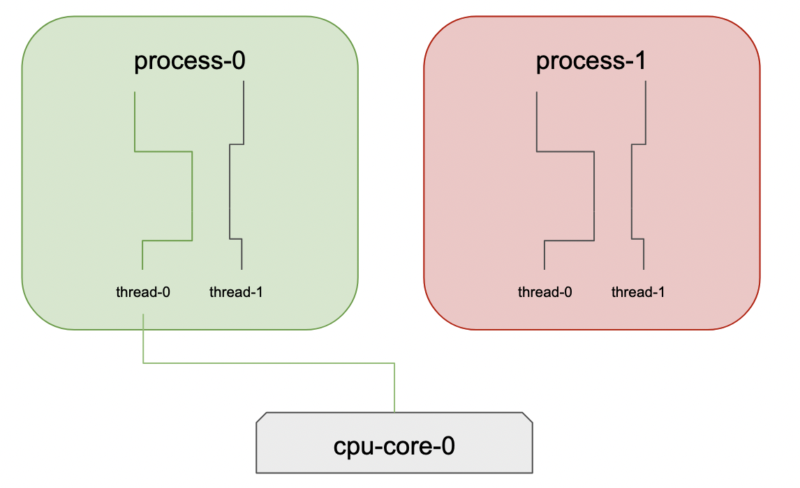

# Distributed Computing

A half-day course on distributed computation in Python:

- functional programming,
- threads & `threading`, processes & `multiprocessing`, `asyncio`,
- the Python ecosystem for distributed computation.

Outcomes:

- how to program in a functional style,
- why `multiprocessing` is a data scientist's best friend,
- understanding concurrency, parallelism and asynchrony,
- using threads & processes in Python,
- introduction to options for distributed computation in Python.


Practical work:

- [functional-programming.ipynb](https://github.com/ADGEfficiency/teaching-monolith/blob/master/distributed-computing/functional-programming.ipynb) - [run in binder](https://mybinder.org/v2/gh/ADGEfficiency/teaching-monolith/HEAD?labpath=distributed-computing%2Ffunctional-programming.ipynb),
- [multiprocessing.ipynb](https://github.com/ADGEfficiency/teaching-monolith/blob/master/distributed-computing/multiprocessing.ipynb) - [run in binder](https://mybinder.org/v2/gh/ADGEfficiency/teaching-monolith/HEAD?labpath=distributed-computing%2Fmultiprocessing.ipynb),
- [mapreduce.ipynb](https://github.com/ADGEfficiency/teaching-monolith/blob/master/distributed-computing/mapreduce.ipynb) - [run in binder](https://mybinder.org/v2/gh/ADGEfficiency/teaching-monolith/HEAD?labpath=distributed-computing%2Fmapreduce.ipynb),
- [asyncio.ipynb](https://github.com/ADGEfficiency/teaching-monolith/blob/master/distributed-computing/asyncio.ipynb) - [run in binder](https://mybinder.org/v2/gh/ADGEfficiency/teaching-monolith/HEAD?labpath=distributed-computing%2Fasyncio.ipynb).


# Summary

## Ecosystem Cheat Sheet

| Framework         | Compute | Language | Number of machines | Problem |
| ---               | ---     | ---      | ---                | --- |
| `threading`         | CPU     | Python   | One                | IO |
| `multiprocessing` | CPU     | Python   | One                | CPU |
| `dask`            | CPU     | Python   | Many               | IO + CPU |
| `ray`             | CPU     | Python   | Many               | IO + CPU |
| Rapids            | GPU     | Python   |  Probably multi-GPU    | |
| Hadoop MapReduce  | CPU     | Java     | Many               | CPU |
| Spark             | CPU     | Java (Scala)     | Many               | CPU |


## Single machine options in Python

Multiple threads with `threading`:

- use on IO bound problems,
- global interpreter lock (GIL) prevents parallel compute with threads (in Python),
- threading (in Python) is not useful for CPU bound tasks (you can only run one thread at once).

Multiple processes with `multiprocessing`:

- use on CPU bound problems,
- requires memory than threads,
- good solution for many data science problems - often we are CPU bound.

Asynchronous with `asyncio`:

- use on IO bound problems,
- concurrent computation with a single thread.


## Multiple machines options in Python

Common options:

- dask - run either by Prefect or Coiled,
- pyspark - Python bindings for Spark (which is implemented in Scala),
- ray - for a stateful actor model of distributed compute,
- tensorflow & pytorch - both can perform compute across many machines & GPUs.


## Batch, streaming and online

Styles of data processing differ mainly on the frequency of the data flow:

- Batch processing is offline - once per day/hour style updates,
- Streaming is both online and offline - often in real time, using tools like Kafka,
- Online services want an immediate reply - websites, REST APIs and databases.

The focus of this course is **batch processing**.


# Functional Programming

[](https://mybinder.org/v2/gh/ADGEfficiency/teaching-monolith/HEAD?labpath=distributed-computing%2Ffunctional-programming.ipynb)

Functional programming concepts (such as map, filter, and reduce) are the atomic operations of many distributed computing frameworks.

Take mapping over a pool of processes (which uses a map):

```python
from multiprocessing import Pool

with Pool(popsize, maxtasksperchild=32) as pool:
    results = p.starmap(episode, zip(population, seeds))
```

We will continue our look at functional using the Binder notebook:

[](https://mybinder.org/v2/gh/ADGEfficiency/teaching-monolith/HEAD?labpath=distributed-computing%2Ffunctional-programming.ipynb)


# Concurrency, Parallelism and Asynchrony

## Foundational Examples


Lawn mowing - can be split into independent tasks (different patches of the lawn).

Baby making - cannot be sped up - more pregnant mothers will not make a child any quicker.

Playing many games of chess against at once:

- grandmaster takes 5 minutes to make a move,
- amateurs take 1 hour,
- games can be played quicker if the grandmaster moves to the next board while the amateur is thinking,
- grandmaster never acts in parallel (only one game at a time), but is acting concurrently (dealin with many games at once).


## Concurrency

[Wikipedia](https://en.wikipedia.org/wiki/Concurrency_(computer_science))

**Concurrency is dealing with many things at once** - it is a property of how we *structure* of a program - whether we can execute a program in a different order.
 
For a concurrent program, the order doesn't matter:

- it can be run in a different order sequentially,
- it can be run in parallel,
- tasks can overlap.

This concurrency requires *communication and coordination* (often waiting).  Being able do something else while you wait can be used to make use of limited hardware (like using a single thread do do many things concurrently).  

In IO bound problems we mostly wait (reading/writing to disk or using the network) - in a concurrent program, this waiting time can be used to do other things (and thereby deal with many things at once).


## Parallelism

**Parallelism is doing many things at once** - it is a property of how we *execute* a program - parallelism is a special case of concurrency.

A key characteristic of a parallelizable program is **independence** - being able to split the work into many tasks that can run independently - they don't rely or interact with any of the other parallelizable tasks.

This concept of independent tasks favours a functional style of programming (where our functions have no side effects and don't depend on state).

We can parallelize compute across:

- threads (in one CPU core),
- CPU cores (in one machine),
- machines,
- data centres,
- regions,
- planets,
- universes.

### Where can I make my program parallel?

Key opportunities for parallelism in code are often long, sequential iteration of independent tasks, such as `for` loops, `maps`.


## Asynchrony

[Wikipedia](https://en.wikipedia.org/wiki/Asynchrony)

Common to use a future/promise - subroutines that to represent an ongoing event occuring external to the main flow of the program - such as waiting for disk or network (IO bound problems).

In Python we can use `asyncio` to program in an asynchronous style.


## Things computers do

Computers do three things:

1. Compute - transform data,
2. Memory/Remember - store data,
3. Network/Communicate - send/receive data.


## How computers compute

The CPU core is **hardware**.  It runs one sequence of computation at a time - it is fundamentally sequential.  The speed of a CPU core is measured in cycles per second (GHz).



Threads are **software** - the software representation of a sequence of computation.  Memory is shared between threads.

Processes are **software** - they are a program that runs threads.  

Each process has a dedicated memory space - making them memory intensive versus threads.


## The problems computers have

The problems we have relate to what we try to do with computers:

1. Compute - doing lots of compute - CPU bound,
2. Memory - not enough storage (RAM or disk) - out of memory (OOM),
3. Network - waiting to read/write data (network, disk) = IO bound.


## Make computer program go fast

1 - CPU bound problems:

- doing the sequential computation faster (faster processor),
- doing the computation in parallel faster (more processors),
- parallelize across CPU cores,
- parallelize with a GPU.

2 - Memory problems:

- being careful about `dtypes` (0 or 1 versus `'true'` and `'false'`),
- only read in columns you need,
- process data in chunks (row wise),
- processing data in smaller chunks,
- avoiding unecessary copies of data,
- setup numpy arrays ahead of time,
- more memory.
 
For GPU memory problems you can reduce model size, reduce batch size or get a bigger GPU.

3 - IO bound problems:

- doing something else while we are waiting,
- threading or async.

Data scientists will mostly be concerned with CPU bound problems - but memory tends to be the limiting factor in most programs.

RAM is expensive, and has historically been the limit on computers, not processor speed - GPUs are an excellent example of this.

## Why distribute compute?

There are diminishing returns on increasing processor speeds - Moore's Law (processor speeds doubling every two years) is coming to an end.

Trend in modern computing is more processors - more CPU cores (common to have 8-16 on laptops).  The GPU is this in the extreme (thousands of CPU cores) per GPU card.

These cores can be on the same machine - they can also be on many different machines. Many machines = **distributed computation**.

The cloud is made up of many small machines working together - it is cheaper to run lots of small machines than less, larger machines. 

A key challenge with running many small machines is dealing with machine failure - being fault tolerant.


## Should I use multiple machines?

- what is your problem (CPU bound or IO bound),
- what language are you working in,
- who is paying,
- is it a one off or a repeated computation.

Distributed computing is fundamentally harder:

- fixed & variable overhead of communication & coordination,
- machine failure.


## Python standard library concurrent computation options

|                   | Threads     | Processes         | Async       |
|-------------------|-------------|-------------------|-------------|
| Library           | `threading` | `multiprocessing` | `aysncio`   |
| Use all CPU cores | no          | yes               | no          |
| Scalability       | 100's       | 10's              | 1000's      |
| GIL problems      | yes         | no                | no          |
| Use case          | IO bound    | CPU bound         | IO bound    |
| Uses OS scheduler | yes         | yes               | no          |
| Multitasking      | preepmtive  | preepmtive        | cooperative |


## `threading`

**Python is not thread safe**.

Python's Global Interpreter Lock (GIL) provides memory safety in Python, at the cost of limiting Python threads to a single core
- the GIL locks onto a a single core.

Threads share memory - they exist in the same process, and same memory space.  It's possible that one thread mutates data needed by another thread.  This makes threads lightweight (in terms of memory) but unsafe (in Python).

`threading` will allow concurrent computation on one thread at a time on a single core:

- not parallelism,
- threads will take turns executing tasks,
- suitable for IO bound problems.

Difficult to get right - if you have an IO bound problem, `asyncio` is a safer choice than attempting multi-threading in Python.


### Sharing isn't always a good thing

Sharing data can be a problem - [race conditions](https://en.wikipedia.org/wiki/Race_condition).

Thread safety = avoiding race conditions that can occur with shared memory - this is done using [locks](https://en.wikipedia.org/wiki/Lock_(computer_science)) at critical points in multi-threaded code.  A lock (aka mutex - mutual exclusion) enforces limits on access to resources - commonly memory.  These locks add overhead.

Locks can cause problems such as [resource starvation](https://en.wikipedia.org/wiki/Starvation_(computer_science)) (denial of access to required resources) or [deadlocks](https://en.wikipedia.org/wiki/Deadlock) (threads waiting on threads waiting on threads).

Sharing memory is hard - writing multithreaded code in Python is also hard - [Raymond Hettinger, Keynote on Concurrency, PyBay 2017](https://www.youtube.com/watch?v=9zinZmE3Ogk) for a detailed example of how to write multithreaded code properly in Python.


## `multiprocessing`

[](https://mybinder.org/v2/gh/ADGEfficiency/teaching-monolith/HEAD?labpath=distributed-computing%2Fmultiprocessing.ipynb)

Processes do not share memory - they exist in their own same memory space.  This makes using many processes in parallel expensive in terms of memory, but much safer.

Communication between Python processes is possible (via pickling) - but you probably don't want to do this (tasks should be independent) - communication = dependency.

No sharing of memory means the GIL isn't a problem - this makes `multiprocessing` our tool of choice for single machine parallel computation.

Means we can parallelize across cores! We can use all the hardware we have, in Python (no more single core)!


## MapReduce

[](https://mybinder.org/v2/gh/ADGEfficiency/teaching-monolith/HEAD?labpath=distributed-computing%2Fmapreduce.ipynb)

[Wikipedia](https://en.wikipedia.org/wiki/MapReduce)

Implementation independent - a method of processing data across multiple machines.

Developed by Google - fundamental to scaling on commodity hardware - now replaced by many other things.

MapReduce is a system for orchestrating distributed & parallel computation:

- execution engine that manages communication & data transfer,
- parallelism provides scalability, redundancy & fault tolerance,
- data = Google File System (GFS),
- compute = MapReduce.

An example of *split-apply-combine*:

1. map = splits input into n tasks,
2. shuffle = workers redistribute data based on map results, so all members of each key are on the same worker node,
3. reduce = process data per key.


## Why can MapReduce be parallel

Map is independent and reduce is independent.  The reduce works on data that all has the same key - the order of combining doesn't matter (concurrent).


## Apache Hadoop

[Wikipedia](https://en.wikipedia.org/wiki/Apache_Hadoop)

Hadoop is open source, and includes an implementation of MapReduce.

It uses a different data format - Hadoop Distributed File System (HDFS).


## Apache Spark

[Wikipedia](https://en.wikipedia.org/wiki/Apache_Spark)

More complex data transformations than MapReduce - also keeps intermediate data in memory (not written to disk).

Spark runs in a Java Virtual Machine and is written in Scala (it has Java & Python bindings). Many businesses run on Java and already have access to a JVM.

It is an extension of Hadoop MapReduce - offering ML, SQL, streaming and graph processing.

Is fundamentally tabular data / dataframe based.


## Dask

[Introduction to Dask](https://docs.dask.org/en/latest/) - [comparison to Spark](https://docs.dask.org/en/latest/spark.html)

Dask is written in Python - has a generic task scheduler and can also be used for dataframe type operations.

Dask offers the ability to process larger than memory datasets and parallelize compute across both threads and processes.

Couples will with pandas, numpy - not entire reimplementations.

We will work through a few sections of the [dask tutorial](https://tutorial.dask.org/00_overview.html) - suggest looking at:

- 01_dask.delayed.ipynb - lazy compute,
- 03_array.ipynb - data larger than memory,
- 04_dataframe.ipynb,
- 05_distributed.ipynb.

[Best practices](https://docs.dask.org/en/latest/delayed-best-practices.html) - call delayed on the function, not the result:

```python
#  lazy - do this
dask.delayed(f)(x, y)

# immediate - don't do this!
dask.delayed(f(x, y))
```

Include lot's of `dask.delayed` in each `dask.compute` call - ideally want one compute call on a large graph.


## ray

[docs](https://ray.readthedocs.io/en/latest/) - [github](https://github.com/ray-project/ray) - [tutorials](https://github.com/ray-project/tutorial)

```bash
$ pip install 'ray[all]'
$ python ray_example.py
```

- task scheduler (same as Dask)
- allows shared state between tasks (`Actor` model)
- bottom up scheduling

Turn off your VPN!
- get problems wint connecting to the redis database

https://github.com/ray-project/ray/issues/642

> Ray uses a distributed bottom-up scheduling scheme in which workers submit tasks to local schedulers, and local schedulers assign tasks to workers. Local schedulers can also forward tasks to global schedulers which can load balance between machines. Dask uses a centralized scheduler, which manages all tasks for the cluster. The point of the bottom-up scheduling approach is to improve task latency and throughput.

Distributed:

- hyperparameter tuning [guide](https://ray.readthedocs.io/en/latest/tune-usage.html),
- reinforcement learning,
- model training.


### ray tune

Hyperparameter tuning library in ray - can be used with Keras, sklearn and PyTorch.

Basic tutorial - [colab](https://colab.research.google.com/github/ray-project/tutorial/blob/master/tune_exercises/exercise_1_basics.ipynb) - [github](https://github.com/ray-project/tutorial/blob/master/tune_exercises/exercise_1_basics.ipynb).


# Async IO and `asyncio`

Async IO is a programming paradigm (language independent) - `asyncio` is the Python implementation.
 
Async IO offers single thread concurrency - not parallelism - a way to do deal with many things at once with a single thread.

Require two things - asynchronous functions (that can stop & start) and an event scheduler.

async / await = API for asynchronous programming

Use for IO bound problems.

Speed will be limited by the slowest step - see [Amdahl's Law](https://en.wikipedia.org/wiki/Amdahl%27s_law) and [rate determining step](https://en.wikipedia.org/wiki/Rate-determining_step).


### Coroutine

[Wikipedia](https://en.wikipedia.org/wiki/Coroutine)

Function that can pause to let others run - a specalized Python generator.

Async routines can pause (to let other routines run) - can stop it's execution before returning - can pass control to another coroutine.


### Cooperative multitasking

Key difference in async versus threads

Threads don't decide when to run - they can switch anytime
- preemptive multitasking 
- OS decides when to run (as for all other programs on your machine)

This can be a problem when things need to be done in a certain order
- this is solved by putting locks in critical sections in multithreaded code

Async switches co-operatively
- cooperative multitasking
- coroutines decide when to run/not run (defined in code)
- control when task switching occurs
- explicitly add `yield` or `await` to cause task switching


## Event loop

[Wikipedia](https://en.wikipedia.org/wiki/Event_loop)

Knows about all the tasks
- when function suspends, control returned to the loop, which then finds another function

Loop that waits & dispatches events
- makes requests of event providers
- calls relevant event handlers

Watches for something to happen, then calls code that cares about what happened

Often the highest level of control in a program
- event A happens (button clicked)
- event A sent to event loop
- event loop checks for a callback registered to handle that click
- callbacks are called, using info from the click

`asyncio` provides an event loop


## `asyncio`

[](https://mybinder.org/v2/gh/ADGEfficiency/teaching-monolith/HEAD?labpath=distributed-computing%2Fasyncio.ipynb)

Cheap task switches
- calling Python function has more overhead than restarting a generator or an awaitable
- functions need to build a new stack frame on each call - generator already has the stack frame built
- async is cheap

The cost of using async is that you need to use non-blocking versions of many things you do alot
- `file.read()`
- `time.sleep()`

The cost of async is the learning curve
- event loop, all calls non-blocking, async + await
- lots of code, lots knowledge


## `async` / `await`

`asyncio` = Python package for managing coroutines

`async` / `await` = Python keywords used to define coroutines

Need to use async versions of many blocking functions from stlib


## Resources / References

[Parallel Programming with numpy and scipy](https://scipy-cookbook.readthedocs.io/items/ParallelProgramming.html)

[Raymond Hettinger, Keynote on Concurrency, PyBay 2017](https://www.youtube.com/watch?v=9zinZmE3Ogk)

[Itamar Turner-Trauring: Small Big Data: using NumPy and Pandas when your data... | PyData NYC 2019](https://www.youtube.com/watch?v=uya_MHnoKa0)

[Tom Augspurger: Scalable Machine Learning with Dask | PyData New York 2019](https://www.youtube.com/watch?v=we1m4-IsbL8)

Designing Data-Intensive Applications - The Big Ideas Behind Reliable, Scalable, and Maintainable Systems - Martin Kleppmann 

[Challenges with distributed systems - Amazon](https://aws.amazon.com/builders-library/challenges-with-distributed-systems/)

[Eric Dill: Is Spark still relevant? Multi-node CPU and single-node GPU workloads.. | PyData NYC 2019](https://www.youtube.com/watch?v=obKZzFRNTxo)

[Learning Spark: Lightning-Fast Big Data Analysis - Patrick Wendell & Matei Zaharia](http://shop.oreilly.com/product/0636920028512.do)

[Multiprocessing Vs. Threading In Python: What You Need To Know](https://timber.io/blog/multiprocessing-vs-multithreading-in-python-what-you-need-to-know/)

[Async IO in Python: A Complete Walkthrough - Real Python](https://realpython.com/async-io-python/)

[I Avoid Async/Await](https://uniqname.medium.com/why-i-avoid-async-await-7be98014b73e) - [HN discussion](https://news.ycombinator.com/item?id=31050650)
