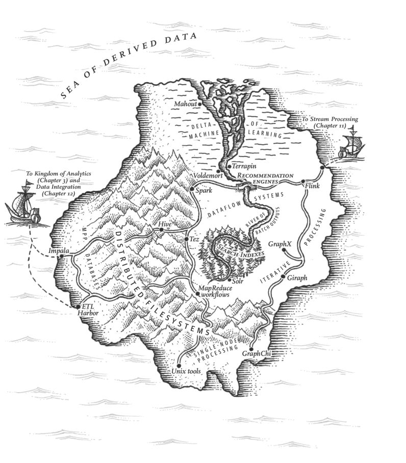

# Distributed computing

A one day course on distributed computation:
- functional programming & map reduce
- parallel computation on a single machine
- should I distribute computation?
- options for distributed computation in Python

We will look at:
- functional programming
- `multiprocessing`
- MapReduce
- hadoop / spark
- dask
- ray


## Ecosystem

| Framework | Compute | Language |
| --- | --- | --- |
| Dask | CPU | Python|
| Ray | CPU | Python|
| Rapids | GPU | Python|
| Hadoop MapReduce | CPU | Java
| Spark | CPU | Java


## Resources

[Itamar Turner-Trauring: Small Big Data: using NumPy and Pandas when your data... | PyData NYC 2019](https://www.youtube.com/watch?v=uya_MHnoKa0)

[Tom Augspurger: Scalable Machine Learning with Dask | PyData New York 2019](https://www.youtube.com/watch?v=we1m4-IsbL8)

Designing Data-Intensive Applications - The Big Ideas Behind Reliable, Scalable, and Maintainable Systems - Martin Kleppmann 
[Challenges with distributed systems - Amazon](https://aws.amazon.com/builders-library/challenges-with-distributed-systems/)

[Eric Dill: Is Spark still relevant? Multi-node CPU and single-node GPU workloads.. | PyData NYC 2019](https://www.youtube.com/watch?v=obKZzFRNTxo)

[Learning Spark: Lightning-Fast Big Data Analysis - Patrick Wendell & Matei Zaharia](http://shop.oreilly.com/product/0636920028512.do)


## Functional programming

Concepts from functional programming are crucial to understand many of the tools we will look at (`multiprocessing`, dask, map-reduce etc)

We will go over these concepts in [functional-programming.ipynb](https://github.com/ADGEfficiency/teaching-monolith/blob/master/distributed-computation/functional-programming.ipynb).


## What do we do with computers?

Compute
- CPU - if/else sequential programs
- CPU threads (share memory, single core) 
- CPU processes (individual space in memory, multiple cores)
- GPU - massively parallel operations

Recent trends in CPU are more cores
- GPU is an example of this
- not faster processors (measured in CPU cycles per second, commonly GHz)
- more cores = allow parallelization
- faster processor = faster sequential computation

Writing code that runs in parallel = future proofing
- be able to take advantage of many cheap cores

Memory
- ram (fast) vs. disk (slow)


## Sequential versus parallel computation

Process the same amount of data in a smaller amount of time

Compute is cheap, time is not

Need to take into account the overhead of distributing across many machines
- fixed and variable costs


## Single versus distributed machines

Distributed computation = using many machines
- often using many small machines (2 core CPU), rather than a few big machines


## Three systems for processing/delivering data

Batch processing
- offline
- once per day update

Streams
- real time
- inbetween online & offline
- kafka, kubernetes
 
Services
- online, want immediate reply
- websites, REST API, databases


# Batch processing


Designing Data-Intensive Applications - The Big Ideas Behind Reliable, Scalable, and Maintainable Systems - Martin Kleppmann 


## Should I do distributed computation?

Stay on single for long as possible 
- distributed is fundamentally harder
- seen above that a multicore single machine has opportunities for parallel computation

Distributed (multiple machines)
- more overhead (model serialization)


## If I have compute problems?

CPU bound
- too long to train a model
- solve with either bigger single machine or distributed with many machines

Compute problems
- parallelize across threads
- parallelize across cores
- parallelize in GPU

`sklearn` uses `joblib` to parallelize across threads or cores on single machine
- training random forests


## If I have memory problems?

- being careful about `dtypes` (0 or 1 versus 'true' and 'false')
- only read in columns we need
- process data in chunks
- smaller batch size (GPU)
- bigger machine


## Don't forget about Bash

Cool example from Designing Data-Intensive Applications 
- can process gigabytes of data in seconds

```bash
cat ~/.bash_history | 
  awk '{print $0}' |
	sort |  # `sort` = repeated URLs n times in a row
	uniq -c | # `uniq` = filers out repeats with a counter
	sort -r -n | # `sort` = by count, in reverse order
	head -n 10
```

Lots can be done with clever combinations of `sed`, `grep`, `sort`, `uniq`, `xargs`
- `sort` will parallelize across CPU cores


## `multiprocessing`

Python has the `multiprocessing` library for doing parallel computation on a single machine

We will take a look at it in [multiprocessing.ipynb](https://github.com/ADGEfficiency/teaching-monolith/blob/master/distributed-computation/multiprocessing.ipynb).


## MapReduce

https://en.wikipedia.org/wiki/MapReduce

Developed by Google - fundamental to them scaling on commodity hardware
- now replaced by streaming systems (MapReduce is batch data processing)

System for orchestrating distributed & parallel computation
- execution engine that manages communication & data transfer
- parallelism provides scalability, redundancy & fault tolerance

- data = Google File System (GFS)
- compute = MapReduce

Split-apply-combine

1. map
2. shuffle = workers redistribute data based on map results, so all members of each key are on the same worker node
3. reduce = process data per key


## Why can MapReduce be parallel

Map is independent

Reducer 
- works on data that all has the same key or
- order of combining doesn't matter 

[map-reduce.ipynb](https://github.com/ADGEfficiency/teaching-monolith/blob/master/distributed-computation/map-reduce.ipynb)


## Apache Hadoop

https://en.wikipedia.org/wiki/Apache_Hadoop

Open source implementation of MapReduce

- data = Hadoop Distributed File System (HDFS)
- compute = MapReduce


## Spark

https://en.wikipedia.org/wiki/Apache_Spark

Spark
- JVM (Java) - many businesses run on Java and have access to a JVM
- extension of map-shuffle-reduce
- more mature, more features

Extension of Hadoop MapReduce
- ML, SQL, streaming, graph processing

Use for parallel data processing
- query optimizer

Tabular data / dataframe based

Has Python bindings `pyspark`


## Dask

[Detailed introduction to Dask](https://docs.dask.org/en/latest/)

[Comparison to Spark](https://docs.dask.org/en/latest/spark.html)

Dask
- Python
- has a generic task scheduler
- **use for dataframe type operations**

Dask offers the ability to
- process larger than memory datasets
- parallelize compute

Couples with pandas, numpy
- not entire reimpelemtations


### Dask Tutorial

We will work through a few sections of the Dask tutorial
- [dask/dask-tutorial](https://github.com/dask/dask-tutorial)

We will look at:
- 01_dask.delayed.ipynb - lazy compute
- 03_array.ipynb - data larger than memory
- 04_dataframe.ipynb
- 05_distributed.ipynb
- 
```
$ git clone http://github.com/dask/dask-tutorial
```

You can build a docker image out of the provided Dockerfile.

```bash
$ docker build . # This will build using the same env as in a)
```

Run a container, replacing the ID with the output of the previous command

```bash
$ docker run -it -p 8888:8888 -p 8787:8787 <container_id_or_tag>
The above command will give an URL (Like http://(container_id or 127.0.0.1):8888/?token=<sometoken>) which can be used to access the notebook from browser. You may need to replace the given hostname with "localhost" or "127.0.0.1".
```

Need the below to get visualize to work:

```bash
!conda install -c conda-forge graphviz -y
!conda install -c conda-forge python-graphviz -y
```

Also need to move some of the `%%time` lines into the cell below

### dask delayed best practices

[Best practices](https://docs.dask.org/en/latest/delayed-best-practices.html)

Call delayed on the function, not the result

```python
#  lazy - do this
dask.delayed(f)(x, y)

# immediate - don't do this!
dask.delayed(f(x, y))
```

Include lot's of `dask.delayed` in each `dask.compute` call
- ideally want one compute call on a large graph


## ray

[docs](https://ray.readthedocs.io/en/latest/) - [github](https://github.com/ray-project/ray) - [tutorials](https://github.com/ray-project/tutorial)

```bash
pip install 'ray[all]'

python ray_example.py
```

- task scheduler (same as Dask)
- allows shared state between tasks (`Actor` model)
- bottom up scheduling

https://github.com/ray-project/ray/issues/642

> Ray uses a distributed bottom-up scheduling scheme in which workers submit tasks to local schedulers, and local schedulers assign tasks to workers. Local schedulers can also forward tasks to global schedulers which can load balance between machines. Dask uses a centralized scheduler, which manages all tasks for the cluster. The point of the bottom-up scheduling approach is to improve task latency and throughput.

Distributed:
- hyperparameter tuning [guide](https://ray.readthedocs.io/en/latest/tune-usage.html)
- reinforcement learning
- model training


## Tune

Hyperparameter tuning library in ray 
- can be used with keras, sklearn, pytorch

Tutorials:
- basics - [colab](https://colab.research.google.com/github/ray-project/tutorial/blob/master/tune_exercises/exercise_1_basics.ipynb) - [github](https://github.com/ray-project/tutorial/blob/master/tune_exercises/exercise_1_basics.ipynb)
