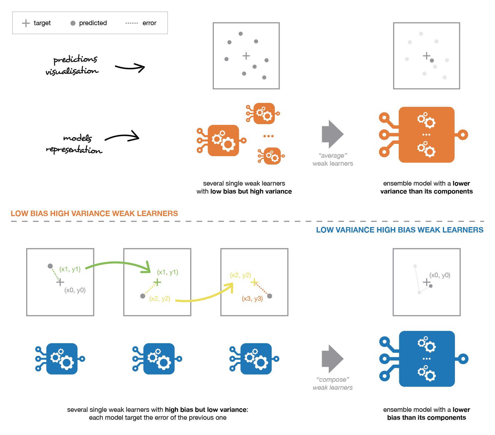
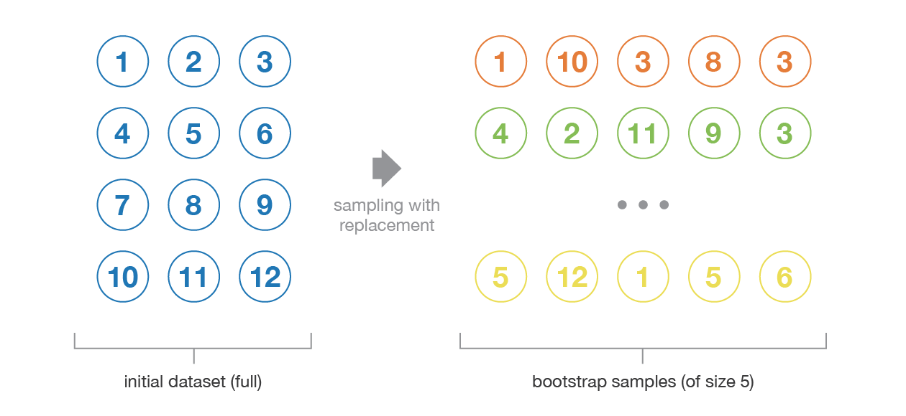
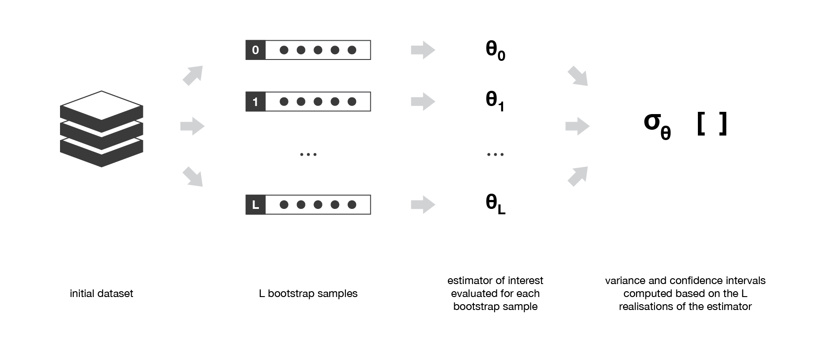

# References

[Please see the readme](https://github.com/ADGEfficiency/teaching-monolith/blob/master/forests/readme.md) for references of the material used to develop these notes.

# Introduction to tree based ensembles

## Key takeaways

Bagging = bootstrap aggregation
- bootstrap = resampling with replacement
- aggregation = combining learners by voting / averaging

Random forests and gradient boosted trees are the same
- ensembles of decision trees

Are different
- order trees are built
- way results are combined

## Why tree based ensembles

Bread and butter of a data scientist
- entire careers are made on the back of tree based methods
- many companies have ensembles in production
- XGBoost is the king of Kaggle

## When to use tree based ensembles

- tabular data
- non-linear & non-smooth relationships
- regression or classification

## Key advantages

- performance
- no scaling of target or features required
- training can be parallelized
- interpretable - feature importances

## What tree based methods

Decision trees

Random forests
- parallel learning
- random sampling of rows (bagging)
- random sampling of features

Boosting
- sequential learning
- random sampling of rows

## Ensembling

**Wisdom of the crowd**

Sir Francis Galton in 1906
- mean & median of guesses of an ox's weight = within 1% of true weight

Combining weak base learners
- base learner = **decision trees**

Different methods of combining multiple base learners
- **bagging** = parallel learners combined by averaging
- **boosting** = sequential, adaptive learning
- stacking = parallel learners combined by training a model

## Error in supervised learning

Error = bias + variance + noise
- noise = unmanageable
- variance = fitting to noise
- bias = missing signal

These different ensemble methods tackle the tradeoff in different ways
- forests = high variance, low bias base learners
- boosting = low variance, high bias base learners



[Image from here](https://towardsdatascience.com/ensemble-methods-bagging-boosting-and-stacking-c9214a10a205).

# Decision trees

[Wikipedia](https://en.wikipedia.org/wiki/Decision_tree)

Training a decision tree is deterministic
- sequence of if/then/else rules that recursively splits a dataset

Decision trees separate data based on features
- separated into two branches at each node
- the split = a decision boundary

Recursive **binary splitting**
- top down & greedy approach (greedy = making best split at each step, rather than looking ahead to a future tree)

Leaf nodes
- terminal
- prediction = mean for regression, most common class for classification

Very interpretable
- combining trees we lose some of this interpretability

Advantages
- interpretability
- non-linear relationships
- use categorical vars without dummy vars

Disadvantages
- high variance
- non-robust (small change in data can cause large change in final tree)

### Splitting

Need some way to measuring the quality of a split
- Gini Index/Impurity
- entropy

For regression, we measure impurity using squared deviations from the mean

### Dealing with categorical variables

One hot encode
- curse of dimensionality makes dimensionality increase exponential
- lose the explicit one columns relationship of the feature

Label encode
- `0, 1, 2, 3`
- is an ordinal encoding - even if feature is not ordinal

Mean encode
- put the training data average for the target for that class

###  Decision trees hyperparameters

Choice of impurity measure

Rules to stop splitting
- minimum size of the subpartition
- minimum impurity reduction - penalty to tree complexity

# Bagging

## Bootstrap sampling

Statistical technique of **resampling**
- create new datasets by resampling (with replacement!) from our original dataset
- samples have good approximate statistical properties (they are iid - hopefully!)
- bootstrap samples also used to evaluate variance or define confidence intervals of statistical estimators
- more sample efficient with our dataset

Can be equal in size to original dataset

## Bagging

Bagging = **bootstrap aggregation**
- fitting trees with different bootstrapped datasets
- combining the trees - often with an average
- parallel learning

Fundamental idea = averaging across high variance, low bias trees
- deep trees = low bias, high variance





[Image from here](https://towardsdatascience.com/ensemble-methods-bagging-boosting-and-stacking-c9214a10a205)

### Bagging reduces variance

Averaging a set of observations reduces variance - [Variance of an average of random variables](https://stats.stackexchange.com/questions/168971/variance-of-an-average-of-random-variables)

Variance of an average over n samples = variance / n

```python
x1 = np.random.normal(0, 2, 100000)
x2 = np.random.normal(0, 2, 100000)

np.var(x1 + x2)  #  should be close to 4 + 4

np.var((x1 + x2) / 2)  #  should be close to 4 + 4 / 2
```

Can use the **out of bag** (OOB) samples to measure generalization
- cross validation for free

# Random forests

[Brieman (2001) Random Forests](https://www.stat.berkeley.edu/~breiman/randomforest2001.pdf)

Random forests are an extension of the bagging idea
- they take the randomness one step further by **randomly sampling features**
- forest of **decorrelated trees**

Sample over
- data (with bootstrapping - aka bagging)
- features to split on

High variance, low bias trees
- average through the variance by combining trees
- different trees overfit in different ways (variance averaged out by voting)

Decorrelate trees by using a random sample of features to split upon
- resample the features each split
- helps to stop over fitting to the strongest features
- higher variance reduction possible by reducing the correlation between trees in the ensemble

Note that if the trees are correlated - it doesn't work
- won't reduce the variance

How correlated are the splits?
- this sets the number of trees

Deeper trees = higher variance
- grow trees deep, no pruning

### Random forest hyperparameters

With these hyperparameters we are trying to control
- how random the split of **data** is (once per tree)
- how random the split of **features** is (once per tree level)
- number of splits (tree depth)

`n_estimators`
- increasing num trees wont affect bias, will only reduce variance

`max_features`
- how many features to split on
- rule of thumb = sqrt(num_features)
- depends on ratio of noisy to important var in dataset
- small num features = reduce variance increase bias
- lots of noisy = small m will decrease probability of choosing an important variable at a split

`min samples per leaf` increase a bit (default is 1) to get smaller trees w less overfitting

`max_depth`
- controls variance

`?`
- minimum terminal node size
- increasing will reduce variance

`?`
- max node size - often set at no limit
- setting a limit will make smaller trees & reduce variance

### Feature importances

When we ensemble decision trees, we lose the interpretability that a single tree gives us

Two ways to measure importance in random forests
- decrease in model accuracy if values of variables are randomly set (on OOB data)
- average decrease in Gini score for all nodes that were split on a variable (on training data)

Accuracy decrease is more reliable, but requires more computation

Gini decrease sheds light on which variables are used for splits

For categorical features, RF are biased in favour of attributes with more levels
- variable importance scores for RF are not reliable for this kind of data

# Boosting

Boosting = leaning models in series (sequentially) to minimize error of previous models

There are a few variants
- AdaBoost (1995)
- gradient boosting
- stochastic gradient boosting (using samples without replacement for each tree)

## Example - teacher journey home length

Your teacher estimates their travel time home by looking at the weather.  A student has access the data they don't (from Google Maps).  The student predicts the teacher will be 5 minutes slower.  The combination of these two prediction is the prediction of a gradient boosted ensemble of two people as base learners (equivalent to trees) using data from the weather and Google Maps (the features).

## Gradient boosted trees

XGBoost + feature engineering = most Kaggle winners

Next tree trained to improve the already trained ensemble by **predicting the residuals**
- prediction is the sum of all trees (weighted by a learning rate)
- sequential learning
- high bias, low variance base learners

In boosting, trees are grown sequentially
- each tree is grown to correct the mistakes of previous trees

GBM = optimizes an objective function - including ranking and poission regression (this is harder with RF)

Optimization occurs in function (not parameter) space
- gradient descent with functions

**Learn slowly**
- fit decision tree to the residuals of the current model
- we use the residuals (rather than Y) as the target
- add this new decision tree into the fitted function in order to update the residuals

Trees can be small, with just a few terminal nodes
- by fitting small trees, we slowly improve in areas where it doesn't perform well

## Boosting hyperparameters

`num_round`
- number of boosting steps

`eta`
- learning rate
- controls how trees are added together
- control variance
- smaller for noisy data

`subsample`
- controls how random the data each base learner trains on is
- sampling without replacement
- control variance

`alpha`
- Manhattan distance
- L1 regularization

`lambda`
- squared Euclidean distance
- L2 regularization

`max_depth`
- control variance

## Starting point hyperparameters

Heard from a Kaggle Grandmaster

Learning rate = 0.05, 1000 rounds, max depth = 3-5, subsample = 0.8-1.0, colsample_bytree = 0.3 - 0.8, lambda = 0 to 5

Add capacity to combat bias - add rounds

Reduce capacity to combat variance - depth / regularization

## How can sequential learning be parallelized?

Parallelization within a single tree
- create branches independently
