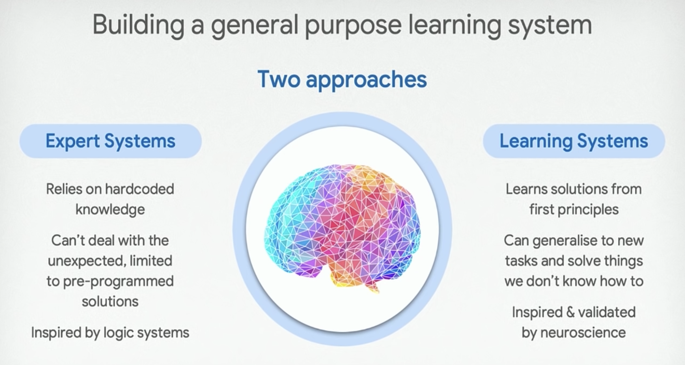

A list of questions and answers for data science, AI and machine learning.

# Data science

## What is it?

Using quantitative methods to extract business insights from structured & unstructured data

Using structured & unstructured data to make predictions that drive business decisions

Solve optimization problems 

Provide recommendations - prediction

Provide business intelligence - data communication

Drive product decisions

Learn & developing new business capabilities
- optimizing for productivity makes sense when you know what to build - in data science this isn't true!  

## Business, analytics, engineering

[DSR curriculum](https://datascienceretreat.com/curriculum/) is built into these three.

- how to structure a team
- should I work at this company
- how shoupd I spend my time

Eng = code & compute

## Data analyst versus data scientist versus data engineer

Amount of data

Analyst
- analyzes the past
- GUI tools
- spreadsheet monkey
- VBA, R, SQL
- Power BI, Tableau

Scientist
- predicts the future
- Python, bash, git

Both should influence business decisions (otherwise what is the point?)

Engineer
- Scala & Spark (maybe PySpark)
- databases
- monitoring
- streaming

## What are the key skills of a data scientist?

Statistics & linear algebra

Supervised machine learning
- linear, ensemble methods (forests & boosting), neural nets

Cleaning data
- learn to enjoy this

Optimization
- linear (constrained optimization, MILP etc)
- non-linear (stochastic gradient descent)

Programming
- test driven development

Communication
- writing & speaking
- visualization

Ability to learn
- metaskill

# AI

## What is AI?

Intelligence demonstrated by machines

A contrast to the natural intelligence displayed by humans

Intelligence 
- learning, problem solving
- competence versus comprehension
- prediction & explainability

## What is the AI effect?

> AI is whatever hasn't been done yet

As machines become increasingly capable, tasks considered to require "intelligence" are often removed from the definition of AI

## Three types of AI

Analytical
- generating a cognitive representation of the world and using learning based on past experience to inform future decisions

Human inspired
- emotional intelligence
- human decision making

Humanized
- self-conscious and self-aware

## Two approaches

## AI approaches

Statistical
- hidden Markov models
- infomation theory
- Bayesian decision theory

Computational intelligence
- connectionism
- neural networks
- fuzzy systems
- evolutionary methods

Symbolic
- simulating human thought
- formal logic
- hand built
- knowledge based

## AI tools

Search & optimization

Logic

Probabilistic methods

Classifiers & statistical learning methods

Neural networks

## What are we missing to get to “real” AI (LeCun 2019)

We can have
- safer cars 
- autonomous cars
- better medical image analysis
- personalized medicine
- adequate language translation 
- useful but stupid chatbots 
- information search, retrieval, filtering
- numerous applications in energy, finance, manufacturing, environmental protection, commerce, law, artistic creation, games,.....

What we cannot have (yet)
- machines with common sense 
- intelligent personal assistants 
- “smart” chatbots”
- household robots
- agile and dexterous robots
- artificial general intelligence (AGI)

# Machine learning

## What is machine learning?

## Supervised

Training a machine by showing example instead of programming it
- when the output is wrong, tweak the parameters

Examples
- speech to words
- image to classes
- portrait to name
- photo to caption
- text to topic

## What are the three types of machine learning?

Why is ML working today?

- we are the product
- branding
- compute

## Why is Tensorflow free?

Eaiser integration with Google Cloud
- platform owner

Product quality

Branding
- talent

Free labour
- dev, bug

---

Learn & developing new business capabilities
- optimizing for productivity makes sense when you know what to build - in data science this isn't true!  

## Skillset of a data scientist

1. Theory (linear algebra, statistics, optimization, algorithms, methodology, modeling of complex systems…)
2. Engineering (end-to-end software development, hardware knowledge depending on the application, project management)
3. Domain Expertise (deep understanding of your chosen field's dynamics and trends)
4. Communication (writing, design, presentation, sales, stakeholder management, collaboration)

Most people I've met that fit the above description are extremely fast learners and insanely curious about other people and the world. There's no single course or professional experience that will teach you everything, so a data scientist needs to be an active protagonist of their own learning journey.

## The full stack data scientist - myth?

## Importance of visualization

Be aware of some graphic design principles

## What do data scientists need

Full stack data scientists require well constructed data platform
- containerization, distributed processing, automatic failover
- hooks into experimentation structure, scaling, visualizing debugging output

## Model selection

Model selection process as having different levels of maturity

- initially choose models we are familiar with
- then choose based on performance, understanding tradeoffs, what works best on small/large datasets
- after seeing model implemented, then start to select based on long term costs & benefits (computation, disk space, volatility, maintenance)

## Further reading

[Beware the data science pin factory: The power of the full-stack data science generalist and the perils of division of labor through function](https://multithreaded.stitchfix.com/blog/2019/03/11/FullStackDS-Generalists/)

What is the most difficult to find attribute in a good data scientist? - [quora](https://www.quora.com/What-is-the-most-difficult-to-find-attribute-in-a-good-data-scientist)
