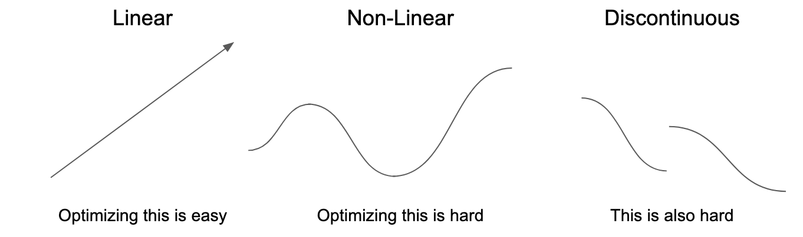
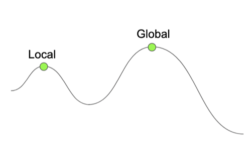
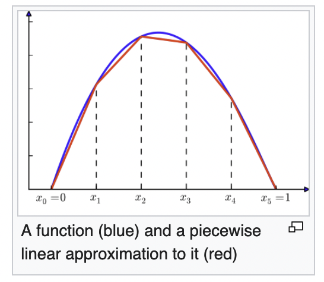
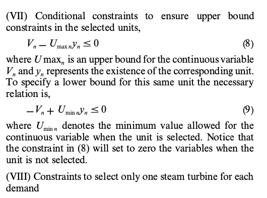

# Linear Programming

A half-day course on **linear programming** - a useful optimization technique.



Key outcomes of this course:

- **the three components of a linear program**,
- what is linearity & why is it important,
- what makes a program non-linear.

After this lecture material we will do practical work together in [linear-programming.ipynb](https://github.com/ADGEfficiency/teaching-monolith/blob/master/linear-programming/linear-programming.ipynb) - [run the notebook on Colab](https://colab.research.google.com/github/ADGEfficiency/teaching-monolith/blob/master/linear-programming/linear-programming.ipynb).


## Resources & Further Reading

[Building Linear Programs With Ortools - Ross Hart | PyData Global 2021](https://youtu.be/rA4QHmjqo1c)

Learn more about linear programming:

- [6 part blog post series on linear programming with PuLP - Ben Alex Keen](http://benalexkeen.com/blog/),
- [Michel Goemans lecture notes](https://math.mit.edu/~goemans/18310S15/lpnotes310.pdf),
- [Linear programming textbook by Thomas Ferguson](https://www.math.ucla.edu/~tom/LP.pdf),
- [Linear programming tricks from the AIMMS Modeling Guide](https://download.aimms.com/aimms/download/manuals/AIMMS3OM_LinearProgrammingTricks.pdf)

Resources used:
- [Piecewise Linearization - Wikipedia](https://en.wikipedia.org/wiki/Piecewise_linear_function),
- [Simplex Method - Wikipedia](https://en.wikipedia.org/wiki/Simplex_algorithm),
- [Linear programming - Wikipedia](https://en.wikipedia.org/wiki/Linear_programming).

Some of my own work with linear programming:

- [dispatching electric battery storage](https://github.com/ADGEfficiency/energy-py-linear),
- [using linear programming to measure forecast accuracy](https://adgefficiency.com/energy-py-linear-forecast-quality/).


## Using linear programs to solve business problems

Writing linear programs requires two skills - the first is what prevents most linear programming business value from being achieved:

1. **identifying the business problem** can be modelled as a linear program,
2. writing the objective, variables and constraints of that program.

You won't need to write a solver, or understand how a linear programming solver works. 

You can be an effective car driver without understanding the chemistry of combustion - **you can solve business problems without understanding the all math behind linear programming**.


## What math do I need?

The main math things to understand are:

1. what linearity is,
2. what a discontinuity is.

Experience will help you understand how to avoid both in your programs.  If you can't (because the problem is highly non-linear, like training a neural network), then you need a non-linear solver.

This isn't a deal breaker - non-linear optimization is useful.  It just lacks one valuable guarantee - that we can get convergence to the global optimum.


## What is writing linear programs like?

Restrictive compared to normal programming - lots of effort to keep the program linear/avoid discontinuities.

Can't use many things programmers rely on often:

- multiplying variables together (this non-linear),
- conditional branching like `if` (this creates a discontinuity),
- discontinuous math operations like `abs` or `max`.

Some of the skill in writing linear programs:

- being able to link variables to each other (without multiplying them together),
- transforming non-linear constraints/objective functions into linear constraints,
- knowing the tricks that are needed for your particular business problem (I've discovered most of mine from 1990's energy engineering papers),
- googling `linear programming tricks` will reveal a wonderful world of tricks for a variety of situations.

But as emphasized above - the more important skill than then above is to **identify that linear programming can be used for your business problem**.

The mathematics of linear programming solvers is not covered here - if you are interested, the [Simplex Method](https://en.wikipedia.org/wiki/Simplex_algorithm) is a good place to start.

The Simplex algorithm (and probably most other linear solvers) is iterative - a key difference from non-linear optimization is that we can figure out where to stop.


## What is linear programming?

A **constrained optimization** method:

- minimize cost or maximize profit,
- under some constraints,
- by changing some variables.

Guaranteed to find the **global optimum**:

- other optimization methods don't have guarantees of finding a global optimum,
- will run deterministically, with no reliance on initial conditions.

Other optimization methods are either non-linear and/or unconstrained:

- non-linear programming - constrained, non-linear,
- stochastic gradient descent - unconstrained, non-linear,
- evolutionary optimization - unconstrained, non-linear.

Training neural networks:

- loss = highly non-linear,
- unconstrained = weights can take on any values,
- very sensitive to weight initialization.

For deep learning, we never find the global optimum for any large neural network loss surface - but local optima are 'good enough'.


## Why not linear programming?

Many problems are not linear:

- an energy balance (where both mass & energy are conserved) is non-linear.  Using LP in energy systems requires making a choice about what to balance (one of mass or energy).
- the efficiency of chillers can be non-linear.


## Three components of a linear program

1. **Objective function** - minimize or maximize,
2. **Variables** - things you can change - continuous, integer or binary,
3. **Constraints** - equality `==` or inequality `>=`, `<=`.

It is important to undertand that these  are the places where can non-linearity come in:

- in the objective function,
- in the constraints.

### 1. Objective function

Also called a cost function (loss in deep learning).

Represents what you want to do - can be either maximization or minimization.


### 2. Variables

Variables can be continuous, integer or binary - binary variables are often used as on/off variables.

A *mixed integer linear program* (MILP) is a linear program where some of the variables are integer - will require an MILP solver.

Most LP is MILP - integer & binary variables are useful to writing linear programs, and you don't lose any convergence guarantee when using integer variables.

Binary variables are commonly used to get conditional logic in linear programs.


### 3. Constraints

Constraints can be equalities or inequalities - both are used.

Reworking constraints is a common place for tricks/skill in linear programs.


## What is optimization?

Making something small (like cost) or big (like profit) by changing variables (parameters, weights) 

An optimization problem has (at minimum) two components:

1. objective function,
2. variables.

Local versus global optima - for a maximization problem, a local optima will have a lower value than the global maxima:



You may come across the term *convex optimization* - a linear program is a convex optimization problem:

- not a useful concept when building programs (but you may come across it),
- there are two types - concave & convex, convex is the linear/easy/good one.


### What makes optimization difficult?

Non-linearity:

- the rate of change of direction changes depending on where you are,
- the correct direction to go changes based on where you are.

Discontinuities:

- optimizers often take a hill-climbing type approach (SGD, Simplex, evolutionary algorithms),
- climbing hills is hard if there are large ravines/gaps.

Both of these features (non-linearity or discontinuites) can be either challenges that make a problem more difficult (but still solvable) or can eliminate using certain algorithms for certain problems.


### What is linearity?


Linear:

- the same way is always up/down,
- there is only one correct way to move up/down - it is always the same, no matter where you are,
- you may come across the term *affine* - this is just a fancy way to say linear.

Non-linear:

- which way is up/down depends on where you are,
- the correct direction to move depends on your current position,
- dependence on state,
- another (unrelated) way to think about non-linearity is *accumulation* (of state - like momentum/inertia).

If you have two variables (two things we can change to make our objective big or small):

```python
from pulp import LpVariable

v = [LpVariable('x'), LpVariable('y')]
```

You cannot do operations that are non-linear:

```python
#  cannot multiply variable by other variable
v[0] * v[1]

#  cannot multiply variable by itself
v[0] * v[0]
```

You cannot do operations that are discontinuous:

```python
#  cannot do conditional logic
if v[0] > 1:

#  this is discontinuous
abs(v[0])
```

One workaround for non-linearity is piece-wise linearization (from [Wikipedia](https://en.wikipedia.org/wiki/Piecewise_linear_function)):




## The value of linearity in linear programming

Linear optimization gives us a guarantee that we can find the global optimum - the absolute best value of our variables.

Non-linear models don't give us this guarantee - making the optimization a noisy and stochastic process (see training neural nets or evolutionary algorithms).


## The cost of linearity in linear programming

Only model linear systems - much of the world is fundamentally non-linear.

More work required for the programmer:

- can't use common programming tools like `if` or `max`,
- most problems have a few tricks to get interactions between variables.


---

**This is the end of the lecture material - below is a deep dive into one trick that is useful in linear programming.**


Now to the practical work in [linear-programming.ipynb](https://github.com/ADGEfficiency/teaching-monolith/blob/master/linear-programming/linear-programming.ipynb) - if you don't have Python installed locally, you can run the notebook [directly on Google Colab](https://githubtocolab.com/ADGEfficiency/teaching-monolith/blob/master/linear-programming/linear-programming.ipynb).


## Deep Dive - linking variables together

From A RIGOROUS MINLP MODEL FOR THE OPTIMAL SYNTHESIS AND OPERATION OF UTILITY PLANTS J. C. BRUNO, F. FERNANDEZ, F. CASTELLS and I. E. GROSSMANN (1998)



Let's imagine we have an asset (such as a gas turbine, or GT) that can operate in the range of 50% to 100%.   We also have a cost function, which in normal programming would look like:

```
cost = gt_load * electric_efficiency * gas_price
```

It would be very easy to set the value of `gt_load` to be either 0 or 0.5 to 1.0 - it is not so easy in linear programs, because this is discontinuous!

One way to model this in a linear program would be with a continuous variable (we will use `puLP` to do this, but the idea holds for all linear programs):

```python
from pulp import LpVariable

load = LpVariable('gt-load-%', lowBound=0.5, upBound=1.0)
```

We would then have a term in the objective function representing the cost for running this unit:

```python
prob = LpProblem('min', LpMinimize)
prob += load * electric_efficiency * gas_price
```

What about if we wanted to model the gas turbine being off?  Currently we can't do this as our variable is constrained to a minimum of 50%.

Something like the below will allow our program to run the GT at 0% (ie off) - but also allow our GT to run at 25% load, which is not possible (many machines cannot operate below 40-50%).

```python
load = LpVariable('gt-load-%', lowBound=0.0, upBound=1.0)
```

One way to solve this problem is to introduce a second binary variable, that represents the GT being on `1` or off `0`:

```python
from pulp import LpVariable

load = LpVariable('gt-load-%', lowBound=0.5, upBound=1.0)
status = LpVariable('gt-on-off', cat='Binary')
```

We want the following two constraints in our program (these come from Bruno et. al (1998)):

```
continuous - max * binary <= 0
- continuous + max * binary <= 0
```

The only way I can understand how these work is to create a table of 'what if' type scenarios.  Let's assume `max=1.0` and `min=0.5` (like our GT) - we can explore the max equation first:

```
continuous - max * binary <= 0
```

| continuous | binary | LHS   | valid |
|------------|--------|-------|-------|
| 0.75       | 1.0    | -0.25 | Yes   |
| 1.0        | 1.0    | 0.0   | Yes   |
| 1.2        | 1.0    | 0.2   | No   |


I will leave it to the engaged & motivated reader to do the same exercise for the minimum bound constraint and different values of the binary variable (for both constraints).
