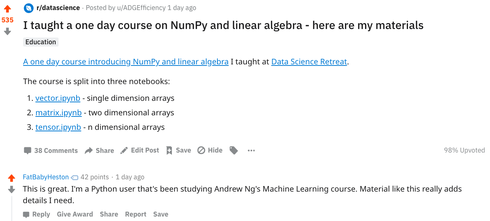

# NumPy

A one day course introducing NumPy and linear algebra.  The course is split into three notebooks:
1. [vector.ipynb](https://github.com/ADGEfficiency/teaching-monolith/blob/master/numpy/1.vector.ipynb) - single dimension arrays
2. [matrix.ipynb](https://github.com/ADGEfficiency/teaching-monolith/blob/master/numpy/2.matrix.ipynb) - two dimensional arrays
3. [tensor.ipynb](https://github.com/ADGEfficiency/teaching-monolith/blob/master/numpy/3.tensor.ipynb) - n dimensional arrays

## Resources & further reading

Chapter 2 of [Deep Learning - Ian Goodfellow, Yoshua Bengio and Aaron Courville](https://www.deeplearningbook.org/)

[Matrix Cookbook](https://www.math.uwaterloo.ca/~hwolkowi/matrixcookbook.pdf)

[A Visual Intro to NumPy and Data Representation](https://jalammar.github.io/visual-numpy/) 

[Understanding the internals of NumPy to avoid unnecessary array copying](https://ipython-books.github.io/45-understanding-the-internals-of-numpy-to-avoid-unnecessary-array-copying/)

Scipy lectures:
- [1.3. NumPy: creating and manipulating numerical data](http://scipy-lectures.org/intro/numpy/index.html)
 - [2.2. Advanced NumPy](http://scipy-lectures.org/advanced/advanced_numpy/)
