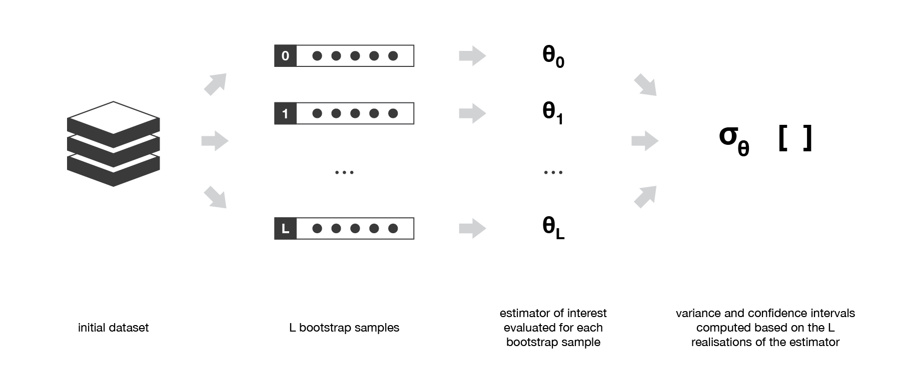

# Random Forests


## Bootstrap sampling

Statistical technique of **resampling**
- create new datasets by resampling (with replacement!) from our original dataset
- samples have good approximate statistical properties (they are iid - hopefully!)
- bootstrap samples also used to evaluate variance or define confidence intervals of statistical estimators
- more sample efficient with our dataset

Can be equal in size to original dataset


## Bagging

Bagging = **bootstrap aggregation**
- fitting trees with different bootstrapped datasets
- combining the trees - often with an average
- parallel learning

Fundamental idea = averaging across high variance, low bias trees
- deep trees = low bias, high variance




[Image from here](https://towardsdatascience.com/ensemble-methods-bagging-boosting-and-stacking-c9214a10a205)


### Bagging reduces variance

Averaging a set of observations reduces variance - [Variance of an average of random variables](https://stats.stackexchange.com/questions/168971/variance-of-an-average-of-random-variables)

Variance of an average over n samples = variance / n

```python
x1 = np.random.normal(0, 2, 100000)
x2 = np.random.normal(0, 2, 100000)

np.var(x1 + x2)  #  should be close to 4 + 4

np.var((x1 + x2) / 2)  #  should be close to 4 + 4 / 2
```

Can use the **out of bag** (OOB) samples to measure generalization
- cross validation for free


## Random forests

Random forests are an extension of the bagging idea
- they take the randomness one step further by **randomly sampling features**
- forest of **decorrelated trees**

Sample over
- data (with bootstrapping - aka bagging)
- features to split on

High variance, low bias trees
- average through the variance by combining trees
- different trees overfit in different ways (variance averaged out by voting)

Decorrelate trees by using a random sample of features to split upon
- resample the features each split
- helps to stop over fitting to the strongest features
- higher variance reduction possible by reducing the correlation between trees in the ensemble

Note that if the trees are correlated - it doesn't work
- won't reduce the variance

How correlated are the splits?
- this sets the number of trees

Deeper trees = higher variance
- grow trees deep, no pruning


### Random forest hyperparameters

Based on the sklearn random forest models
- [regressor](https://scikit-learn.org/stable/modules/generated/sklearn.ensemble.RandomForestRegressor.html)

With these hyperparameters we are trying to control
- how random the split of **data** is (once per tree)
- how random the split of **features** is (once per tree level)
- number of splits (tree depth)

`n_estimators`
- increasing num trees wont affect bias, will only reduce variance

`max_depth`
- controls variance

`min_samples_split`
- samples required to split a node
- controls variance

`min_samples_leaf`
- samples required on the left & right nodes after a split
- controls variance

`min_weight_fraction_leaf`
- relevant if sample weighting is used

`max_features`
- how many features to split on
- rule of thumb = sqrt(num_features)
- depends on ratio of noisy to important var in dataset
- small num features = reduce variance increase bias
- lots of noisy = small m will decrease probability of choosing an important variable at a split

`max_leaf_nodes`
- interacts with max depth

`min_impurity_decrease`
- threshold on the quality of splits allowed

`max_samples`
- how many samples to have in the bootstrapped dataset

`n_jobs`
- how many CPU cores to use when training


### Feature importances

When we ensemble decision trees, we lose the interpretability that a single tree gives us

Two ways to measure importance in random forests
- decrease in model accuracy if values of variables are randomly set (on OOB data) - more reliable, but requires more computation
- average decrease in Gini score for all nodes that were split on a variable (on training data) - sheds light on which variables are used for splits

```python
def plot_feature_importances(rf, cols, model_dir='.'):
    importances = pd.DataFrame()
    importances.loc[:, 'importances'] = rf.feature_importances_
    importances.loc[:, 'features'] = cols
    importances.sort_values('importances', inplace=True)
    f, a = plt.subplots()
    importances.plot(ax=a, kind='bar', x='features', y='importances')
    plt.gcf().subplots_adjust(bottom=0.3)
    f.savefig(os.path.join(model_dir, 'importances.png'))
```

For categorical features, RF are biased in favour of attributes with more levels
- variable importance scores for RF are not reliable for this kind of data


### Feature selection

Non-predictive features don't hurt so much with trees
- use multiple metrics that are proxies for same concept as predictors
- two or three things that measure it indirectly
- ie absolute and relative differences!
