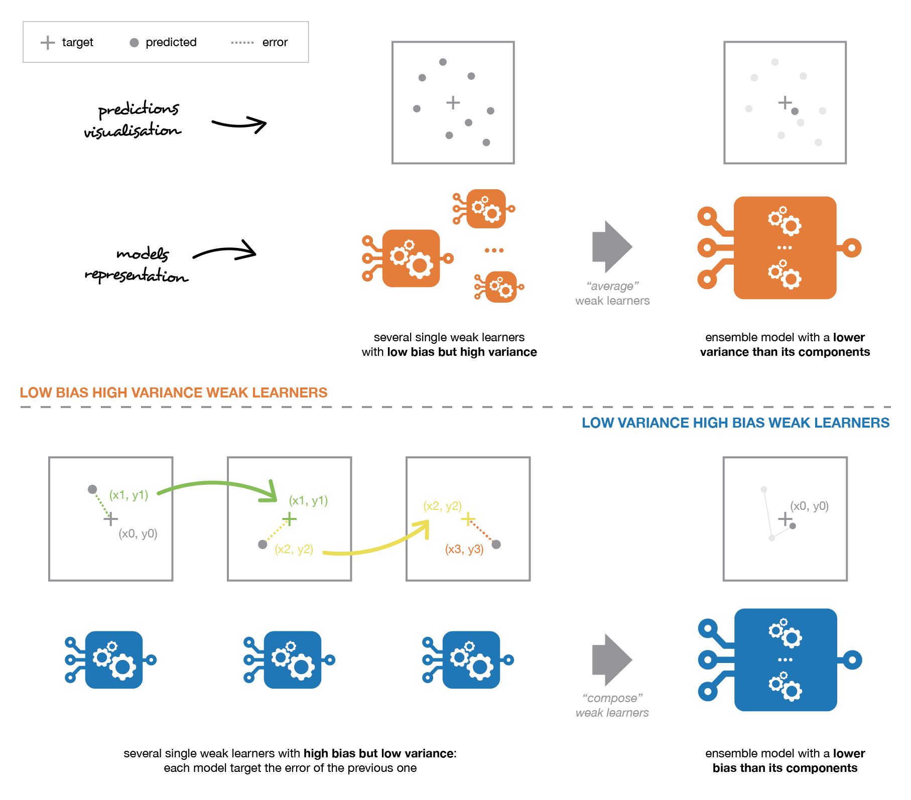

# Decision Trees

## Why ensembles of trees 

Bread and butter of a data scientist
- entire careers will be made on the back of tree based methods
- many companies have ensembles in production
- XGBoost is the king of Kaggle

## When to use tree based ensembles

- tabular data
- non-linear & non-smooth relationships
- ordinal features
- regression or classification

## Key advantages

- predictive performance
- no scaling of target or features required
- fast training - can be parallelized
- output probabilities - based on the voting
- interpretable - feature importances

## What tree based methods are there?

Decision tree
- single, deterministic 

Random forests
- parallel learning
- random sampling of rows with replacement - bootstrapping
- random sampling of features

Boosting
- sequential learning
- random sampling of rows

## Ensembling

**Wisdom of the crowd**

Sir Francis Galton in 1906
- mean & median of guesses of an ox's weight = within 1% of true weight

Combining weak base learners
- base learner = **decision trees**

Different methods of combining multiple base learners
- **bagging** = parallel learners combined by averaging
- **boosting** = sequential, adaptive learning
- stacking = parallel learners combined by training a model

## Error in supervised learning

Error = bias + variance + noise
- noise = unmanageable
- variance = fitting to noise
- bias = missing signal

These different ensemble methods tackle the tradeoff in different ways
- forests = high variance, low bias base learners
- boosting = low variance, high bias base learners

[Image from here](https://towardsdatascience.com/ensemble-methods-bagging-boosting-and-stacking-c9214a10a205).

## Decision trees

[Wikipedia](https://en.wikipedia.org/wiki/Decision_tree)

Training a decision tree is deterministic
- sequence of if/then/else rules that recursively splits a dataset

Recursive **binary splitting**
- top down & greedy approach (greedy = making best split at each step, rather than looking ahead to a future tree)

Leaf nodes
- terminal
- prediction = mean for regression, most common class for classification

Very interpretable
- combining trees we lose some of this interpretability

Advantages
- interpretability
- non-linear relationships
- use categorical vars without dummy vars

Disadvantages
- high variance
- non-robust (small change in data can cause large change in final tree)

### Finding the decision boundary for a split

We want to make splits that give us the best separation (aka purity) in our child nodes

We make splits based on sorted features
- separated into two branches at each node
- the split = a decision boundary
- left = petal length less that 3, right = petal length greater than 3

Split the data on the feature that results in the largest information gain (IG)

$$ IG = I_{parent} - \frac{N_{left}}{N} I_{left} - \frac{N_{right}}{N} I_{right} $$

We have options for how we measure information $I$, all based on the probability (or proportion) $P$ of the classes in our parent & child nodes
- gini coefficient = $G = 1 - \sum P^{2} $
- entropy = $E = - \sum P \cdot \log P $

[See here for a detailed example](https://www.bogotobogo.com/python/scikit-learn/scikt_machine_learning_Decision_Tree_Learning_Informatioin_Gain_IG_Impurity_Entropy_Gini_Classification_Error.php)

For regression, we measure impurity using squared deviations from the mean

### Decision trees hyperparameters

Choice of impurity measure

Rules to stop splitting
- minimum size of the sub-partition
- minimum impurity reduction - penalty to tree complexity
